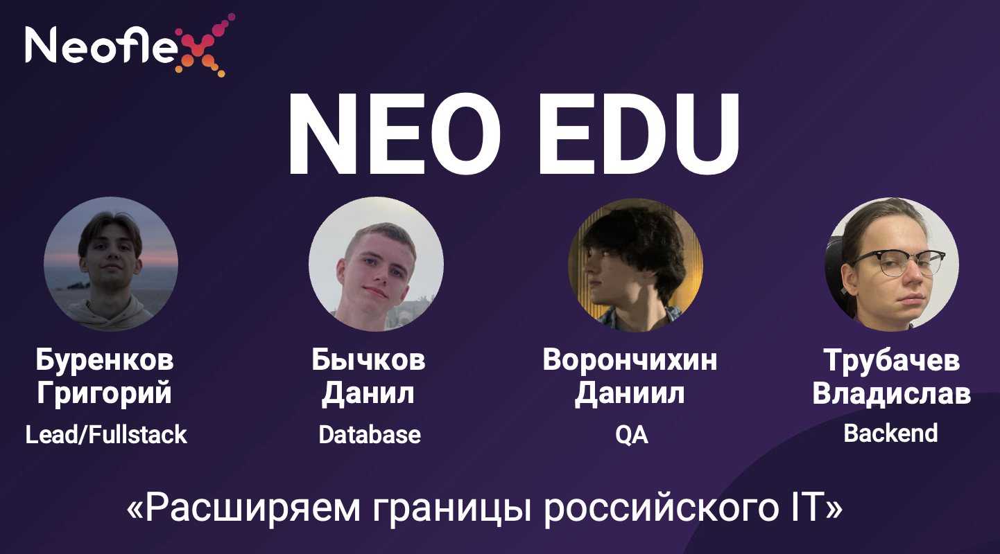

# NEO EDU (Hakaton Neoflex 2026)

**NEO EDU** — корпоративная LMS для ИТ-обучения: витрина курсов, уроки с теорией и практикой, проверка кода в песочнице, матрица компетенций и прогресс студента. Проект подготовлен в рамках хакатона **Neoflex**; слоган команды — *«Расширяем границы российского IT»*.

**Команда:** Буренков Григорий — Lead / Fullstack · Бычков Данил — Database · Ворончихин Даниил — QA · Трубачев Владислав — Backend.



**Демонстрация работы сайта:** [видео на YouTube](https://youtu.be/Zep8DZ1PEqc)

---

Технически это **монорепозиторий**: **React (Vite)** + **Go (Gin)** + **PostgreSQL** (часто Supabase как хост). Ниже — один документ **на разных уровнях глубины**: можно остановиться после быстрого старта или углубиться в архитектуру и БД.

---

## Уровень 0 — запуск за несколько минут

**Предпосылки:** Node.js ≥ 20 (см. `apps/web/package.json`), Go 1.25+ (см. `apps/api/go.mod`), доступная база PostgreSQL.

1. В **корне** репозитория — **единственный** файл окружения:
   ```bash
   cp .env.example .env
   ```
   **Обязательно для API:** `DATABASE_URL`, `JWT_SECRET`.  
   **Для витрины курсов из Supabase в браузере:** `VITE_SUPABASE_URL` и ключ (`VITE_SUPABASE_ANON_KEY` или `VITE_SUPABASE_PUBLISHABLE_DEFAULT_KEY`). Без них часть UI будет пустой, но REST API на Go доступен.  
   В **development** поле **`VITE_API_URL` оставьте пустым** (прокси Vite → бэкенд). Не вставляйте сюда строку PostgreSQL.

2. Зависимости фронта и оркестратора:
   ```bash
   cd apps/web && npm install && cd ../..
   npm install
   ```

3. Миграции (из каталога API):
   ```bash
   cd apps/api && go run ./cmd/migrate && cd ../..
   ```

4. Запуск **фронта и бэка одной командой** из корня:
   ```bash
   npm run dev
   ```
   Альтернатива: [`task dev`](https://taskfile.dev/) при установленном Task.

- Интерфейс: **http://localhost:5173**
- API напрямую: **http://localhost:8080** (в dev основной сценарий — заход через 5173, запросы `/api` идут через прокси)

Проверка API: `GET http://localhost:8080/api/health` или через прокси `http://localhost:5173/api/health`.

**Если в логах Vite видите `http proxy error` / `ECONNREFUSED` на `/api`:** фронт успел открыть страницу раньше, чем Go занял порт `8080`. Скрипт `npm run dev` теперь ждёт `tcp:127.0.0.1:8080` перед стартом Vite; выполните в корне `npm install`, чтобы подтянулся `wait-on`. Не запускайте только `cd apps/web && npm run dev`, если API не запущен отдельно.

---

## Уровень 1 — что это за продукт (идея)

- **Студент** видит витрину курсов, записывается, проходит уроки (текст, видео, квизы, IDE), отправляет код; успешные решения фиксируются в БД, обновляются **прогресс по курсу** и **матрица компетенций**.
- **Модератор** создаёт курсы, уроки и задачи через защищённые эндпоинты.
- **Проверка кода** выполняется на стороне Go через **Judge0** (внешняя песочница); эталон сравнивается с stdout.
- **Supabase** в типичной конфигурации — это прежде всего **PostgreSQL** и иногда прямые запросы фронта к PostgREST; **логин/пароль LMS** обслуживает **собственный** бэкенд и таблица `users`, не Supabase Auth.

---

## Уровень 2 — карта репозитория

| Каталог | Содержимое |
|---------|------------|
| `apps/web` | SPA, структура FSD: `app`, `pages`, `widgets`, `features`, `shared` |
| `apps/api` | HTTP API, JWT, работа с БД, Judge0, `cmd/migrate` |
| `infra/postgres` | Миграции, `schema.sql`, документация ERD |
| `docs/` | [architecture.md](docs/architecture.md), [database.md](docs/database.md), [readme-assets/](docs/readme-assets/) — баннер команды и доп. скриншоты |

**Почему два `package.json`?**  
- **`apps/web/package.json`** — реальное приложение: React, Vite, скрипты `dev` / `build` / `lint`.  
- **`package.json` в корне** — только удобство: `concurrently` запускает **и** `go run` в `apps/api`, **и** `npm run dev` в `apps/web`. Без корневого файла можно обойтись, используя только `task dev` или два терминала.

Подробности по слоям:

- [apps/api/README.md](apps/api/README.md) — бэкенд  
- [apps/web/README.md](apps/web/README.md) — фронтенд  

---

## Уровень 3 — архитектура и данные

- Обзор системы: [docs/architecture.md](docs/architecture.md)
- Таблицы и миграции: [docs/database.md](docs/database.md)
- Диаграмма: [infra/postgres/db-erd.md](infra/postgres/db-erd.md)

---

## Сборка продакшен-артефактов

Из **корня** (фронт + бэкенд подряд):

```bash
npm run build
```

По отдельности: `npm run build:web`, `npm run build:api`.

Проверка типов только фронта: `cd apps/web && npx tsc -b` (в корне нет `tsconfig.json`, команда `npx tsc -b` там не подходит).

---

## Медиа

Баннер команды: [docs/readme-assets/team.png](docs/readme-assets/team.png). Дополнительные скриншоты для README — в **[docs/readme-assets/](docs/readme-assets/)**.

---

## Отдельный запуск процессов

```bash
cd apps/api && go run ./cmd/server
cd apps/web && npm run dev
```

---

## CI (GitHub Actions)

При push и pull request в ветки `main`, `master` или `prod` запускается [`.github/workflows/ci.yml`](.github/workflows/ci.yml): **web** — `npm ci`, ESLint, production build; **api** — `go test`, сборка `cmd/server`.

---

## Контакты

- **Разработчик**: Григорий Буренков  
- **Email**: skvorgrand@gmail.com
