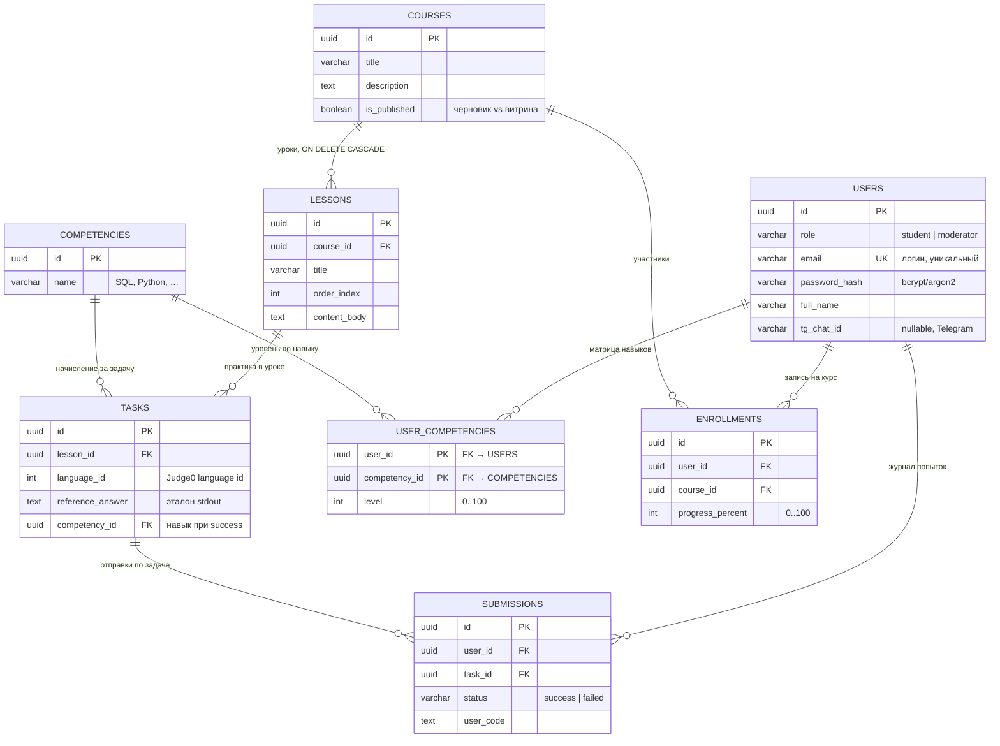

# ERD: база данных NEO EDU (PostgreSQL / Supabase)

Диаграмма соответствует [`db.md`](db.md). Составной первичный ключ: `USER_COMPETENCIES` (`user_id`, `competency_id`).

## Связи (кратко)

| От | К | Тип | Примечание |
|----|---|-----|------------|
| `LESSONS` | `COURSES` | N : 1 | `course_id`; при удалении курса — каскад по урокам |
| `TASKS` | `LESSONS` | N : 1 | `lesson_id` |
| `TASKS` | `COMPETENCIES` | N : 1 | `competency_id` — какой навык качается при верном решении |
| `SUBMISSIONS` | `USERS` | N : 1 | `user_id` |
| `SUBMISSIONS` | `TASKS` | N : 1 | `task_id`; защита от повторного начисления по паре user + task + success |
| `USER_COMPETENCIES` | `USERS` | N : 1 | `user_id` (часть PK) |
| `USER_COMPETENCIES` | `COMPETENCIES` | N : 1 | `competency_id` (часть PK) |
| `ENROLLMENTS` | `USERS` | N : 1 | `user_id` |
| `ENROLLMENTS` | `COURSES` | N : 1 | `course_id` |

На уровне БД имеет смысл добавить уникальный ограничение на пару `(user_id, course_id)` в `ENROLLMENTS`, если одна запись = одна активная запись студента на курс (в `db.md` не зафиксировано — по желанию при миграции).
