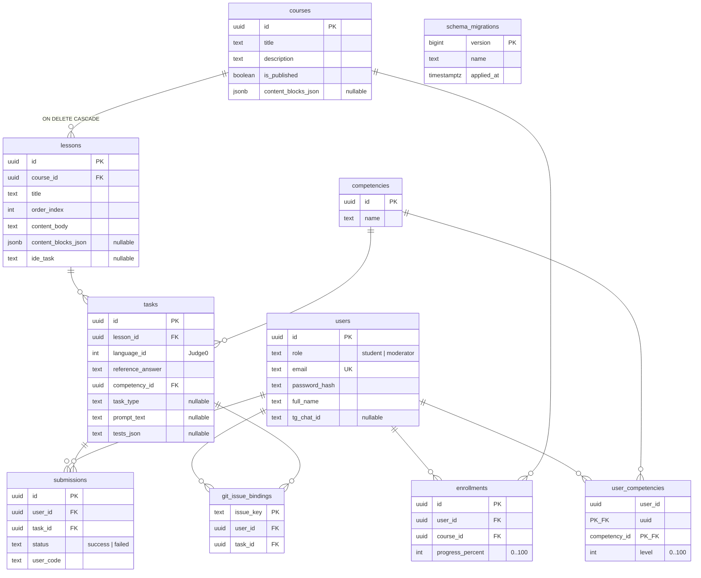

# ERD: база данных NEO EDU (PostgreSQL / Supabase)

Логическая модель совпадает с таблицами в `public.*` после применения миграций из [`migrations/`](migrations/). Текстовое описание полей и форматов JSON — в [**`docs/database.md`**](../../docs/database.md).

Дополнительно в БД создаётся служебная таблица **`public.schema_migrations`** (версия, имя файла, время применения) — её добавляет раннер `apps/api/cmd/migrate`, а не файлы доменных миграций.

## Связи (кратко)

| От | К | Примечание |
|----|---|------------|
| `lessons` | `courses` | `course_id`, каскад при удалении курса |
| `tasks` | `lessons` | `lesson_id` |
| `tasks` | `competencies` | `competency_id` — навык при успешной проверке |
| `submissions` | `users`, `tasks` | уникальный partial index на `(user_id, task_id)` при `status = 'success'` |
| `user_competencies` | `users`, `competencies` | составной PK `(user_id, competency_id)` |
| `enrollments` | `users`, `courses` | **UNIQUE** `(user_id, course_id)` в миграциях |

На диаграмме для читаемости не показаны все nullable-колонки уроков (`video_embed_url`, `quiz_*`, `ide_template`, …) — они перечислены в `docs/database.md` и в `schema.sql`.
